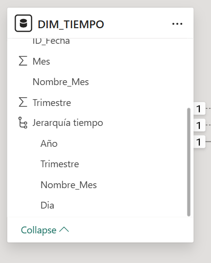
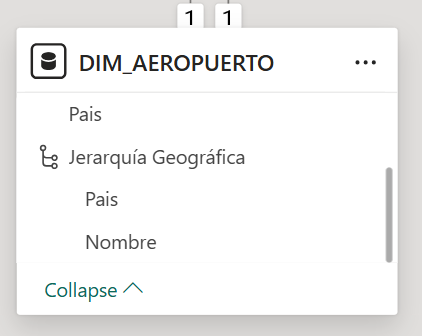
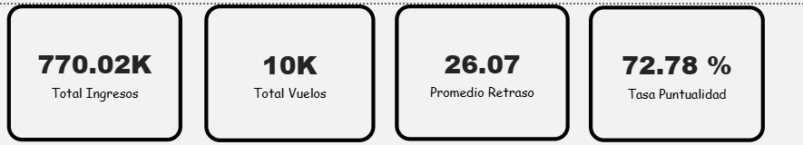
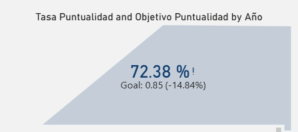
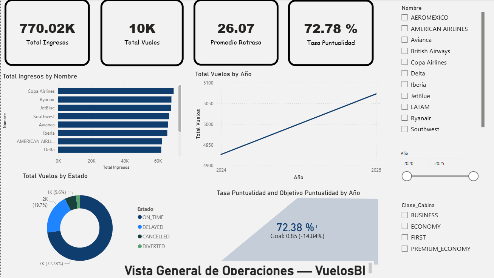
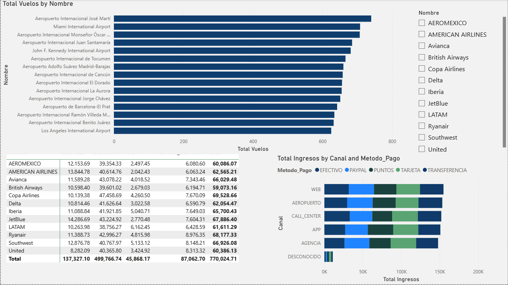
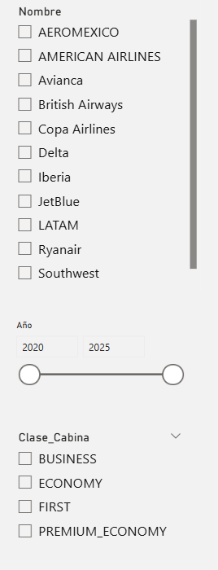

# Documentación Técnica — Práctica 2
## Diseño de Dashboard y KPIs con Power BI

**Curso:** Seminario de Sistemas 2  
**Universidad:** San Carlos de Guatemala — Facultad de Ingeniería  
**Semestre:** 2026-1  
**Base de datos:** VuelosBI (SQL Server)

---

## Índice

1. [Introducción](#1-introducción)
2. [Diseño del Modelo Tabular](#2-diseño-del-modelo-tabular)
3. [Medidas DAX](#3-medidas-dax)
4. [KPIs e Indicadores de Desempeño](#4-kpis-e-indicadores-de-desempeño)
5. [Dashboard — Visualizaciones](#5-dashboard--visualizaciones)
6. [Conclusiones y Recomendaciones](#6-conclusiones-y-recomendaciones)

---

## 1. Introducción

Las organizaciones del sector aéreo generan grandes volúmenes de datos transaccionales que, sin un análisis adecuado, no aportan valor para la toma de decisiones. En esta práctica se conectó Power BI Desktop a la base de datos relacional **VuelosBI** (creada en la Práctica 1 sobre SQL Server), con el objetivo de transformar datos operativos de vuelos en información estratégica mediante un dashboard interactivo.

El modelo de datos sigue un esquema estrella con una tabla de hechos central (`Hechos_Vuelo`) y 9 tablas de dimensión que cubren aerolíneas, pasajeros, aeropuertos, tiempo, canales de venta, métodos de pago, aeronaves, clases de cabina y estados de vuelo. Los datos incluyen aproximadamente 10,000 registros de vuelos con información de precios, retrasos, duración y estado operativo.

### Objetivo

Construir un dashboard interactivo con KPIs estratégicos que permita visualizar el desempeño operativo de las aerolíneas, identificar tendencias temporales y apoyar la toma de decisiones mediante indicadores clave como la tasa de puntualidad, ingresos totales y análisis de retrasos.

---

## 2. Diseño del Modelo Tabular

### 2.1 Conexión a la fuente de datos

Se estableció conexión directa desde Power BI Desktop hacia SQL Server Express utilizando los siguientes parámetros:

| Parámetro | Valor |
|-----------|-------|
| Servidor | `localhost\SQLEXPRESS` |
| Base de datos | `VuelosBI` |
| Modo de conectividad | Importar (Import) |
| Autenticación | Windows (Trusted Connection) |

Se importaron las 10 tablas del modelo: `Hechos_Vuelo`, `DIM_AEROLINEA`, `DIM_PASAJERO`, `DIM_AEROPUERTO`, `DIM_TIEMPO`, `DIM_CANAL`, `DIM_METODO_PAGO`, `DIM_AERONAVE`, `DIM_CLASE` y `DIM_ESTADO_VUELO`.

### 2.2 Relaciones del modelo

El modelo sigue un esquema estrella donde `Hechos_Vuelo` es la tabla central conectada a las 9 dimensiones. Se configuraron 12 relaciones en total:

| Tabla Hechos (FK) | Tabla Dimensión (PK) | Cardinalidad | Estado |
|---|---|---|---|
| ID_Aerolinea | DIM_AEROLINEA.ID_Aerolinea | Muchos a 1 | Activa |
| ID_Pasajero | DIM_PASAJERO.ID_Pasajero | Muchos a 1 | Activa |
| ID_Aeropuerto_Origen | DIM_AEROPUERTO.ID_Aeropuerto | Muchos a 1 | **Activa** |
| ID_Aeropuerto_Destino | DIM_AEROPUERTO.ID_Aeropuerto | Muchos a 1 | Inactiva |
| ID_Fecha_Salida | DIM_TIEMPO.ID_Fecha | Muchos a 1 | **Activa** |
| ID_Fecha_Llegada | DIM_TIEMPO.ID_Fecha | Muchos a 1 | Inactiva |
| ID_Fecha_Reserva | DIM_TIEMPO.ID_Fecha | Muchos a 1 | Inactiva |
| ID_Canal | DIM_CANAL.ID_Canal | Muchos a 1 | Activa |
| ID_Metodo | DIM_METODO_PAGO.ID_Metodo | Muchos a 1 | Activa |
| ID_Aeronave | DIM_AERONAVE.ID_Aeronave | Muchos a 1 | Activa |
| ID_Clase | DIM_CLASE.ID_Clase | Muchos a 1 | Activa |
| ID_Estado_Vuelo | DIM_ESTADO_VUELO.ID_Estado_Vuelo | Muchos a 1 | Activa |

**Nota sobre Role-Playing Dimensions:** `DIM_TIEMPO` y `DIM_AEROPUERTO` se utilizan como dimensiones de rol múltiple. Power BI solo permite una relación activa entre dos tablas, por lo que las relaciones secundarias se configuraron como inactivas y se activan mediante `USERELATIONSHIP()` en medidas DAX cuando es necesario.

- **DIM_TIEMPO** tiene relación activa por `ID_Fecha_Salida` (la fecha de salida es la más relevante para análisis operativo).
- **DIM_AEROPUERTO** tiene relación activa por `ID_Aeropuerto_Origen`.

### 2.3 Jerarquías

Se crearon dos jerarquías para habilitar el drill-down en las visualizaciones:

**Jerarquía Temporal** (en DIM_TIEMPO):

```
Año → Trimestre → Nombre_Mes → Dia
```

Esta jerarquía permite navegar desde una vista anual hasta el detalle diario en los gráficos de tendencia.



**Jerarquía Geográfica** (en DIM_AEROPUERTO):

```
País → Nombre (del aeropuerto)
```

Permite analizar el volumen de vuelos primero por país y luego desglosar por aeropuerto específico.



---

## 3. Medidas DAX

Se crearon 4 medidas DAX principales más una medida de objetivo para el KPI. Todas las medidas se definieron en la tabla `Hechos_Vuelo`.

### 3.1 Total Ingresos

```dax
Total Ingresos = SUM(Hechos_Vuelo[Precio_Ticket])
```

**Descripción:** Suma todos los precios de tickets en USD. Es la métrica principal de ingresos y representa el volumen monetario total de la operación.

**Resultado actual:** **770.02K USD** (aproximadamente $770,000 en ingresos totales).

**Relevancia estratégica:** Permite evaluar el desempeño financiero global de las aerolíneas y comparar ingresos entre aerolíneas, rutas, clases de cabina y períodos de tiempo.

### 3.2 Total Vuelos

```dax
Total Vuelos = SUM(Hechos_Vuelo[Cantidad_Vuelo])
```

**Descripción:** Cuenta el número total de vuelos (cada registro en la tabla de hechos representa un vuelo-pasajero con Cantidad_Vuelo = 1).

**Resultado actual:** **10K** (aproximadamente 10,000 vuelos).

**Relevancia estratégica:** Indicador de volumen operativo. Permite identificar temporadas altas/bajas y comparar actividad entre aerolíneas y rutas.

### 3.3 Promedio Retraso

```dax
Promedio Retraso = AVERAGE(Hechos_Vuelo[Retraso])
```

**Descripción:** Calcula el retraso promedio en minutos, ignorando valores nulos (vuelos sin retraso o cancelados).

**Resultado actual:** **26.07 minutos** de retraso promedio.

**Relevancia estratégica:** Un retraso promedio de 26 minutos indica áreas de mejora operativa. Este indicador es clave para evaluar la calidad del servicio y la satisfacción del pasajero.

### 3.4 Tasa de Puntualidad (KPI Principal)

```dax
Tasa Puntualidad = 
DIVIDE(
    CALCULATE(
        [Total Vuelos],
        DIM_ESTADO_VUELO[Estado] = "ON_TIME"
    ),
    [Total Vuelos],
    0
)
```

**Descripción:** Calcula el porcentaje de vuelos que llegaron a tiempo (estado "ON_TIME") respecto al total de vuelos. Se formateó como porcentaje.

**Resultado actual:** **72.78%** de puntualidad.

**Relevancia estratégica:** Este es el KPI principal del dashboard. La industria aérea considera aceptable una tasa de puntualidad del 80-85%. Con un 72.78%, el indicador está por debajo del estándar, lo cual señala la necesidad de investigar las causas de retrasos y cancelaciones.

### 3.5 Objetivo de Puntualidad

```dax
Objetivo Puntualidad = 0.85
```

**Descripción:** Meta fija del 85% que se utiliza como referencia en el visual KPI con semáforo para comparar contra la tasa de puntualidad actual.



---

## 4. KPIs e Indicadores de Desempeño

### 4.1 KPI Principal: Tasa de Puntualidad

| Aspecto | Detalle |
|---------|---------|
| **Medida** | Tasa Puntualidad |
| **Valor actual** | 72.78% |
| **Objetivo** | 85% |
| **Desviación** | -14.84% por debajo del objetivo |
| **Estado del semáforo** | 🔴 Rojo (no cumple el objetivo) |
| **Eje de tendencia** | Por Año |

El KPI se implementó utilizando el visual nativo de KPI de Power BI, configurando:
- **Value:** Tasa Puntualidad
- **Target:** Objetivo Puntualidad (0.85)
- **Trend axis:** DIM_TIEMPO[Año]

El semáforo muestra en **rojo** porque el valor actual (72.78%) está por debajo del objetivo (85%), indicando que se requieren acciones correctivas.



### 4.2 Interpretación de los Indicadores

**Tasa de Puntualidad (72.78%):** El hecho de que aproximadamente 1 de cada 4 vuelos no llegue a tiempo representa un problema operativo significativo. Las causas pueden incluir congestión en aeropuertos clave, condiciones meteorológicas o problemas logísticos de aerolíneas específicas. Se recomienda analizar qué aerolíneas y rutas contribuyen más a los retrasos para focalizar las acciones correctivas.

**Distribución de estados de vuelo:**
- **ON_TIME:** 72.78% — La mayoría de vuelos llegan a tiempo, pero no alcanzan el estándar.
- **DELAYED:** 19.7% — Casi una quinta parte de los vuelos presenta retraso.
- **CANCELLED:** 5.6% — Un porcentaje bajo pero significativo de cancelaciones.
- **DIVERTED:** ~2% — Porcentaje menor de vuelos desviados.

**Retraso promedio (26.07 min):** Un retraso promedio superior a 25 minutos es considerable. Combinado con la tasa de puntualidad, sugiere que cuando los vuelos se retrasan, el impacto es sustancial.

**Ingresos totales (770.02K USD):** Los ingresos se distribuyen de manera relativamente pareja entre aerolíneas, con Copa Airlines y Ryanair liderando. La diversificación de ingresos es saludable y no existe dependencia excesiva de una sola aerolínea.

---

## 5. Dashboard — Visualizaciones

### 5.1 Página 1: Vista General de Operaciones



Esta página presenta un resumen ejecutivo de la operación con los siguientes componentes:

| Visual | Tipo | Descripción | Decisión que apoya |
|--------|------|-------------|-------------------|
| Tarjetas KPI | Card (x4) | Total Ingresos, Total Vuelos, Promedio Retraso, Tasa Puntualidad | Visión rápida del estado general de la operación |
| Ingresos por Aerolínea | Clustered Bar Chart | Compara ingresos totales por cada aerolínea | Identificar aerolíneas con mayor y menor contribución financiera |
| Tendencia de Vuelos | Line Chart | Evolución del total de vuelos por año usando la Jerarquía Tiempo | Detectar tendencias de crecimiento o contracción en el volumen |
| Estado de Vuelos | Donut Chart | Distribución porcentual de estados (ON_TIME, DELAYED, CANCELLED, DIVERTED) | Evaluar la calidad operativa global |
| KPI Semáforo | KPI Visual | Tasa de Puntualidad vs Objetivo 85% con tendencia anual | Monitorear el indicador clave contra la meta establecida |
| Segmentadores | Slicer (x3) | Filtros por Aerolínea, Año y Clase de Cabina | Permitir análisis interactivo y exploración libre de datos |

**Hallazgos clave de la Página 1:**
- Copa Airlines y Ryanair son las aerolíneas con mayores ingresos (~60K USD cada una).
- La tendencia de vuelos muestra un incremento entre 2024 y 2025.
- El 72.78% de puntualidad está 14.84 puntos porcentuales por debajo del objetivo.

### 5.2 Página 2: Análisis de Ventas y Rutas



Esta página profundiza en el análisis de canales de venta, métodos de pago y rutas:

| Visual | Tipo | Descripción | Decisión que apoya |
|--------|------|-------------|-------------------|
| Vuelos por Aeropuerto | Clustered Bar Chart | Ranking de aeropuertos por volumen de vuelos | Identificar los aeropuertos con mayor tráfico |
| Ingresos por Canal y Método de Pago | Stacked Bar Chart | Distribución de ingresos por canal de venta, desglosado por método de pago | Optimizar estrategias de venta por canal |
| Matriz Aerolínea × Clase | Matrix | Tabla cruzada de ingresos por aerolínea y clase de cabina | Análisis detallado de rentabilidad por segmento |
| Segmentador | Slicer | Filtro por Aerolínea | Análisis interactivo por aerolínea específica |

**Hallazgos clave de la Página 2:**
- El Aeropuerto Internacional José Martí (La Habana) y Miami International Airport lideran en volumen de vuelos.
- WEB y AEROPUERTO son los canales de venta con mayor volumen de ingresos.
- TARJETA es el método de pago dominante en todos los canales.
- La clase ECONOMY genera la mayor proporción de ingresos en todas las aerolíneas.

### 5.3 Interactividad y Filtros



Los segmentadores permiten filtrar todas las visualizaciones de cada página de forma simultánea:

- **Filtro por Aerolínea:** Permite aislar el análisis para una aerolínea específica, actualizando todas las métricas e indicadores.
- **Filtro por Año:** Permite comparar el desempeño entre 2024 y 2025.
- **Filtro por Clase de Cabina:** Permite analizar diferencias entre ECONOMY, BUSINESS, FIRST y PREMIUM_ECONOMY.

Al seleccionar cualquier combinación de filtros, todas las visualizaciones se actualizan automáticamente, demostrando la interactividad del dashboard.

---

## 6. Conclusiones y Recomendaciones

### Conclusiones

1. **La tasa de puntualidad (72.78%) está significativamente por debajo del objetivo del 85%.** Esto indica que casi 1 de cada 4 vuelos no llega a tiempo, representando un área crítica de mejora operativa para las aerolíneas.

2. **El retraso promedio de 26 minutos complementa la baja puntualidad**, sugiriendo que no solo hay vuelos retrasados, sino que los retrasos son de magnitud considerable cuando ocurren.

3. **Los ingresos están diversificados entre aerolíneas**, con Copa Airlines y Ryanair liderando pero sin dominancia excesiva. Esto representa un portafolio saludable.

4. **Los canales digitales (WEB, APP) muestran participación significativa** en las ventas, lo cual indica una buena adopción de canales digitales por parte de los pasajeros.

5. **TARJETA es el método de pago preferido** en todos los canales, lo cual simplifica la gestión de cobros pero sugiere oportunidad de incentivar otros métodos.

### Recomendaciones

1. **Investigar las aerolíneas con peor puntualidad** mediante el filtro de aerolínea en el dashboard, y establecer planes de mejora específicos por cada una.

2. **Analizar las rutas con mayor retraso** usando el filtro de aeropuertos para identificar si el problema es logístico (aeropuerto congestionado) u operativo (aerolínea específica).

3. **Establecer metas intermedias** de puntualidad (ej. 78% para Q1, 82% para Q2) para alcanzar progresivamente el objetivo del 85%.

4. **Fortalecer los canales digitales** de venta (WEB y APP), ya que muestran buen desempeño y tienen menor costo operativo que los canales presenciales.

5. **Implementar alertas automáticas** en Power BI Service para notificar cuando la tasa de puntualidad caiga por debajo de umbrales críticos.

---